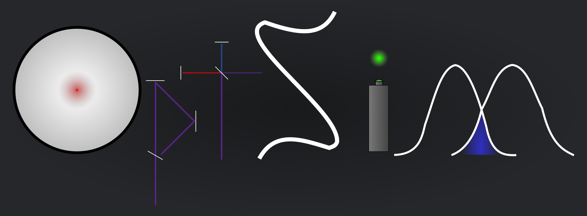

# OptSim
Python package for simulations of optical wave guides and other similar systems


### Installation

Open a terminal in the directory with the pyproject.toml file and use the command

```
python3 -m pip install .
```

or, alternativelly

```
python3 -m pip install path/to/pyproject/dir
```